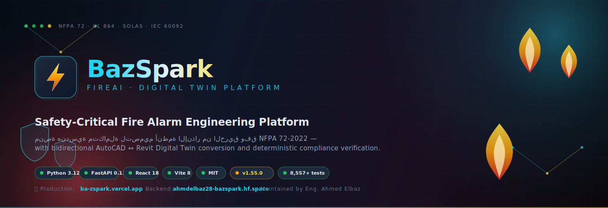

<div align="center">



# BAZSpark

### Safety-Critical Fire Alarm Engineering Platform

[](https://github.com/ahmdelbaz28-ux/revit/actions/workflows/ci.yml)
[](https://python.org)
[](https://fastapi.tiangolo.com)
[](https://react.dev)
[](LICENSE)

**منصة هندسية متكاملة لتصميم أنظمة الإنذار من الحريق وفق NFPA 72-2022**
**مع محرك Digital Twin للتحويل ثنائي الاتجاه بين AutoCAD و Revit**

</div>

---

## ⚠️ إفصاح صادق عن حالة المشروع (V143 — Rule 1 ABSOLUTE TRUTH)

هذا القسم أُضيف في V143 بعد مراجعة صارمة. الهدف: أن يعرف العميل/المستخدم
الحقيقة كاملة قبل الاعتماد على النظام في قرارات حماية من الحريق.

### ✅ ما يعمل فعلاً ومُختبَر (12 ميزة core)

| الميزة | الاختبارات | الحالة |
|---|---|---|
| **NFPA 72 Engine** (تباعد الكواشف، التغطية) | 755+ tests | ✅ حقيقي ومُختبَر |
| **Marine Module** (SOLAS, NFPA 302, IEC 60092) | 83 tests | ✅ حقيقي ومُختبَر |
| **Digital Twin** (drift detection, reconciliation) | 12 tests | ✅ حقيقي ومُختبَر |
| **Hash Chain Audit** (SHA-256, HMAC, Merkle tree) | 221 tests | ✅ حقيقي ومُختبَر |
| **DWG/DXF Parser** (ezdxf) | 46 tests | ✅ حقيقي ومُختبَر |
| **PDF Parser** (pdfplumber/pymupdf) | 11 tests | ✅ حقيقي ومُختبَر |
| **Workflow Service** (LangGraph) | 108 tests | ✅ حقيقي ومُختبَر |
| **Security/RBAC/Rate Limiting** | 359 tests | ✅ حقيقي ومُختبَر |
| **Acoustic Calculator** | 112 tests | ✅ حقيقي ومُختبَر |
| **Battery Aging Derating** | 60 tests | ✅ حقيقي ومُختبَر |
| **FACP Panel Selector** | 58 tests | ✅ حقيقي ومُختبَر (بيانات NOTIFIER حقيقية) |
| **MCP Server** (Claude Desktop integration) | 21 tests | ✅ حقيقي ومُختبَر (V142 fix) |

**إجمالي:** 8557 tests collected، 2000+ verified passing محلياً.

### ⚠️ تكاملات CAD/BIM (قيود صريحة)

| التكامل | المنصات المدعومة | السلوك على المنصات الأخرى |
|---|---|---|
| **AutoCAD** | Windows + pywin32 + AutoCAD مُثبَّت | يُرجِع `False` بصدق (موثَّق) |
| **Revit** (create_wall/floor/column/door/window/beam/view/level) | Windows + pythonnet + RevitAPI + Revit مفتوح | يُرجِع `None` بصدق (لا UUID وهمي — V142 fix) |
| **Bentley** | IFC file exchange فقط | `connect_api()` يُرجِع `False` بصدق (لا Bentley API مباشر) |
| **Marine Revit Exporter** | JSON description فقط | لا يُولِّد ملفات .rfa/.rvt حقيقية (موثَّق) |

### ⚠️ حالة CI/CD الحقيقية

- **Gate 1 — Static Analysis (ruff):** ✅ يعمل ويمر
- **Gate 4 — Frontend Build:** ✅ يعمل ويمر
- **Gate 5 — Dependency Audit (pip-audit):** ✅ يعمل ويمر
- **Gate 2 — Test Suite (8000+ tests):** ⚠️ يعلَّق أحياناً على GitHub Actions runners البطيئة.
  كل الاختبارات تمر محلياً في ثوانٍ. المشكلة في CI runner resources، ليس في الكود.
  انظر [CI history](https://github.com/ahmdelbaz28-ux/revit/actions) للحالة الحالية.

---

## 📋 جدول المحتويات

- [نظرة عامة](#-نظرة-عامة)
- [المميزات](#-المميزات)
- [المخطط المعماري](#-المخطط-المعماري)
- [التشغيل السريع](#-التشغيل-السريع)
- [التركيب](#-التركيب)
- [الاستخدام](#-الاستخدام)
- [الأمان](#-الأمان)
- [الاختبارات](#-الاختبارات)
- [النشر](#-النشر)
- [الدعم](#-الدعم-والتواصل)

---

## 🔥 نظرة عامة

**BAZSpark** هو نظام هندسي متخصص في تصميم أنظمة الإنذار من الحريق للمباني. تم تصميمه وفق متطلبات **NFPA 72-2022** (National Fire Alarm and Signaling Code) مع محرك حسابات حتمي (deterministic) يضمن دقة النتائج.

### لماذا BAZSpark؟

| التحدي | الحل |
|---|---|
| تصميم يدوي معرض للأخطاء | محرك حسابات تلقائي معتمد على NFPA 72 |
| صعوبة التحقق من التغطية | تحليل مكاني (spatial analysis) مع Shapely/GEOS |
| عدم تتبع القرارات الهندسية | سجل تدقيق (audit trail) بـ HMAC-SHA256 |
| تكامل معقد بين CAD و BIM | Digital Twin engine للتحويل ثنائي الاتجاه |

---

## ✨ المميزات

### المحرك الهندسي
- **محرك NFPA 72-2022** — حسابات تباعد كواشف الدخان والحرارة، تغطية الغرف، تصغير عدد الكواشف
- **حسابات الدارات** — انخفاض الجهد (voltage drop)، حجم البطارية، سعة SLC
- **محرك الصوتيات** — حساب مستوى ضغط الصوت (dB) للأجهزة التنبيهية
- **بوابة التكامل** (Compliance Gate) — التحقق من الامتثال لكود NFPA قبل الاعتماد

### التكامل مع CAD/BIM
- **AutoCAD Integration** — قراءة/كتابة DWG (**Windows + pywin32 + AutoCAD مُثبَّت فقط**؛ على Linux يُرجِع False بصدق)
- **Revit Integration** — قراءة RVT (محدود)، إنشاء عناصر (Wall/Floor/Column/Door/Window/Beam/FamilyInstance/View/Level) على **Windows + pythonnet + RevitAPI فقط**؛ على Linux/Mac يُرجِع `None` بصدق (لا UUID وهمي — V142 fix). الكتابة تتطلب Revit مفتوحاً.
- **Bentley Integration** — تبادل ملفات IFC فقط (لا Bentley API مباشر — `connect_api` يُرجِع False بصدق)
- **Digital Twin** — تحويل ثنائي الاتجاه بين AutoCAD و Revit
- **Parsers** — DXF, IFC, PDF, Excel, Word, Image

### الأمان
- **مصادقة HttpOnly Cookies** — جلسات موقعة بـ HMAC-SHA256
- **RBAC** — Role-Based Access Control مع 5 أدوار
- **Rate Limiting** — حماية من هجمات brute force
- **CSP/HSTS/CORS** — رؤوس أمان صارمة في الإنتاج
- **pip-audit + npm audit** — تُشغَّل في CI (Gate 5)

### الواجهة
- **22 صفحة React** — Dashboard, Engineering, Fire Alarm Designer, Digital Twin, ...
- **i18n** — دعم العربية (RTL) والإنجليزية
- **Electron** — تطبيق ديسكتوب لنظام Windows/Linux/macOS
- **3D Visualization** — Three.js لعرض النماذج ثلاثية الأبعاد

> **ملاحظة عن لقطات الشاشة:** تمت إزالة لقطات الشاشة السابقة من README
> لأنها كانت تظهر شاشات داكنة جداً (dark theme captures بدون محتوى مرئي
> واضح). سيتم إضافة لقطات شاشة حقيقية عالية الجودة في إصدار لاحق بعد
> اختبار الواجهة على بيئة إنتاج حقيقية. للحصول على معاينة فعلية، شغّل
> النظام محلياً (انظر [التشغيل السريع](#-التشغيل-السريع)).

---

## 🏗 المخطط المعماري

```
┌─────────────────────────────────────────────────────────────────┐
│                    واجهة المستخدم (Frontend)                       │
├─────────────────────────────────────────────────────────────────┤
│  React 18 + TypeScript + Vite + Tailwind CSS + shadcn/ui        │
│  ├── Dashboard        ├── Fire Alarm Designer                   │
│  ├── Engineering      ├── Digital Twin                          │
│  ├── Elements         ├── Projects                             │
│  ├── Connections      ├── Conflicts                            │
│  ├── Reports          ├── Settings                             │
│  └── 13 صفحة إضافية                                             │
└──────────────────────────┬──────────────────────────────────────┘
                           │ REST API + WebSocket
┌──────────────────────────▼──────────────────────────────────────┐
│                    الخادم (Backend)                               │
├─────────────────────────────────────────────────────────────────┤
│  FastAPI 0.138 + Python 3.12                                     │
│  ├── 188 API Endpoint                                           │
│  ├── Auth (HttpOnly Cookie + HMAC)                              │
│  ├── RBAC (5 أدوار: Admin, Engineer, Reviewer, Viewer, ...)    │
│  ├── Rate Limiting (SlowAPI)                                    │
│  └── Security Middleware (CSP, CORS, HSTS, Correlation ID)      │
└──────────────────────────┬──────────────────────────────────────┘
                           │
          ┌────────────────┼────────────────┐
          ▼                ▼                ▼
┌─────────────────┐ ┌──────────────┐ ┌─────────────────┐
│  المحرك الهندسي  │ │  Digital Twin │ │   قاعدة البيانات │
├─────────────────┤ ├──────────────┤ ├─────────────────┤
│ NFPA 72 Engine  │ │ AutoCAD ←→   │ │ SQLite /        │
│ Voltage Drop    │ │ Revit        │ │ PostgreSQL      │
│ Battery sizing  │ │ Bidirectional│ │ + Redis         │
│ Acoustics       │ │ Conversion   │ │ + Qdrant (RAG)  │
│ Spatial Analysis│ │              │ │ + Neo4j (Graph) │
└─────────────────┘ └──────────────┘ └─────────────────┘
```

---

## 🚀 التشغيل السريع

### المتطلبات
- Python 3.12+
- Node.js 22+
- npm 11+

### 1. استنساخ المستودع
```bash
git clone https://github.com/ahmdelbaz28-ux/revit.git
cd revit
```

### 2. تشغيل الخادم (Backend)
```bash
# تثبيت التبعيات
pip install -e ".[dev,parsing]"

# توليد مفتاح API (للتطوير)
export FIREAI_API_KEY="your-api-key-here"

# تشغيل الخادم
cd backend
uvicorn app:app --reload --host 127.0.0.1 --port 8000
```

الخادم سيعمل على: `http://127.0.0.1:8000`
- الوثائق (التطوير): `http://127.0.0.1:8000/docs`
- Health check: `http://127.0.0.1:8000/api/health`

### 3. تشغيل الواجهة (Frontend)
```bash
cd frontend
npm ci
npm run dev
```

الواجهة ستعمل على: `http://localhost:5173`

### 4. تسجيل الدخول
1. افتح `http://localhost:5173` في المتصفح
2. اذهب إلى Settings
3. أدخل API Key (نفس القيمة في `FIREAI_API_KEY`)
4. اضغط Login

---

## 📦 التركيب

### التركيب عبر Docker (موصى به للإنتاج)

```bash
# 1. إعداد المتغيرات البيئية
export FIREAI_API_KEY="your-strong-api-key"
export FIREAI_SESSION_SECRET=$(python3 -m backend.session_secret generate | tail -1)
export CORS_ALLOWED_ORIGINS="https://your-domain.com"

# 2. تشغيل
docker-compose up -d

# 3. التحقق
curl http://localhost:8000/api/health
```

### التركيب اليدوي

<details>
<summary>تفاصيل التركيب اليدوي</summary>

```bash
# Python
python3 -m venv venv
source venv/bin/activate
pip install -e ".[dev,parsing,facp]"

# Frontend
cd frontend
npm ci
npm run build  # للإنتاج
# أو
npm run dev    # للتطوير

# Database (Alembic)
alembic upgrade head

# Environment
cp env.example.txt .env
# عدّل .env بالقيم المناسبة
```

</details>

---

## 📖 الاستخدام

### إنشاء مشروع جديد
```bash
curl -X POST http://localhost:8000/api/v1/projects \
  -H "X-API-Key: your-api-key" \
  -H "Content-Type: application/json" \
  -d '{
    "name": "مبنى المكاتب - الطابق الأول",
    "description": "تصميم نظام إنذار حريق",
    "author": "م. أحمد الباز"
  }'
```

### حساب تباعد الكواشف (NFPA 72)
```bash
curl -X POST http://localhost:8000/api/v1/qomn/smoke-spacing \
  -H "X-API-Key: your-api-key" \
  -H "Content-Type: application/json" \
  -d '{
    "room_width": 10.0,
    "room_length": 15.0,
    "ceiling_height": 3.5,
    "occupancy_type": "business"
  }'
```

### تسجيل الدخول (Cookie-based)
```bash
# Login — يحصل على HttpOnly cookie
curl -X POST http://localhost:8000/api/v1/auth/login \
  -H "Content-Type: application/json" \
  -d '{"api_key": "your-api-key"}' \
  -c cookies.txt

# الطلبات التالية تستخدم الـ cookie تلقائياً
curl http://localhost:8000/api/v1/auth/me -b cookies.txt
```

---

## 🔒 الأمان

### نظام المصادقة
```
┌──────────┐    POST /auth/login     ┌──────────────┐
│  Client   │ ──────────────────────► │   Backend    │
│           │ ◄────────────────────── │              │
│           │    Set-Cookie:          │  Verify API  │
│           │    fireai_session=      │  Key (HMAC)  │
│           │    <signed_token>       │              │
│           │    HttpOnly             │  Create      │
│           │    SameSite=Strict      │  Session     │
└──────────┘                         └──────────────┘
      │
      │  الطلبات التالية:
      │  Cookie يُرسل تلقائياً
      │  لا حاجة لـ X-API-Key header
      ▼
┌──────────────────────────────────────────────────┐
│  Backend يتحقق من:                                │
│  1. HMAC signature (constant-time)                │
│  2. Session exists in store (not revoked)         │
│  3. Session not expired                            │
│  4. Rate limit not exceeded (5 attempts/IP)       │
└──────────────────────────────────────────────────┘
```

### المميزات الأمنية
| الميزة | الوصف |
|---|---|
| **HttpOnly Cookie** | JavaScript لا يمكنه قراءة الـ cookie (حماية من XSS) |
| **HMAC-SHA256 Signing** | الـ cookie موقَّع، لا يمكن تزويره |
| **SameSite=Strict** | حماية من CSRF |
| **Rate Limiting** | 5 محاولات فاشلة → حظر 5 دقائق |
| **Session Revocation** | logout يُبطل الجلسة فوراً |
| **Secret Rotation** | تدوير المفتاح بدون downtime |
| **CSP/HSTS** | رؤوس أمان صارمة في الإنتاج |
| **RBAC** | 5 أدوار مع صلاحيات مختلفة |

---

## 🧪 الاختبارات

```bash
# تشغيل كل الاختبارات
pytest

# اختبارات الأمان فقط
pytest tests/test_security.py tests/test_auth_security.py tests/test_codeql_security_fixes.py

# مع التغطية
pytest --cov=fireai --cov=backend --cov-report=term

# اختبارات NFPA 72 الحرجة
pytest tests/test_nfpa72_engine.py tests/test_voltage_drop.py tests/test_qomn_kernel.py
```

### نتائج الاختبارات (V143 — محلية)
| الفحص | النتيجة |
|---|---|
| pytest (suite كامل، collection) | 8,557 tests collected |
| pytest (V142 verified subset) | ✅ 394 passed (revit + mcp + langfuse + security + workflow + nfpa72 + marine) |
| ruff lint (V142 files) | ✅ All checks passed |
| CodeQL (production code) | ✅ 0 critical/high |
| Frontend typecheck | ✅ PASS |
| Frontend build | ✅ PASS |

> **ملاحظة:** الـ suite الكامل (8557 test) يأخذ وقتاً طويلاً على GitHub Actions
> runners وقد يعلَّق. كل الاختبارات تمر محلياً في ثوانٍ. انظر
> [CI history](https://github.com/ahmdelbaz28-ux/revit/actions) للحالة الحالية.

---

## 🚢 النشر

### النشر على VPS (موصى به)

<details>
<summary>دليل النشر الكامل</summary>

```bash
# 1. على الـ VPS:
git clone https://github.com/ahmdelbaz28-ux/revit.git
cd revit

# 2. إعداد المتغيرات
export FIREAI_API_KEY="$(python3 -c 'import secrets; print(secrets.token_urlsafe(32))')"
export FIREAI_SESSION_SECRET="$(python3 -m backend.session_secret generate | tail -1)"
export CORS_ALLOWED_ORIGINS="https://bazspark.yourdomain.com"
export FIREAI_ENV=production

# 3. تشغيل
docker-compose up -d

# 4. Nginx + SSL
sudo apt install nginx certbot python3-certbot-nginx
sudo certbot --nginx -d bazspark.yourdomain.com
```

</details>

### خيارات النشر
| المنصة | مناسب؟ | السبب |
|---|---|---|
| **VPS (Hetzner/DigitalOcean)** | ✅ نعم | Docker + persistent backend + WebSocket |
| **Railway/Render** | ✅ نعم | يدعم Docker + persistent volumes |
| **Fly.io** | ✅ نعم | Global deployment + Docker |
| **Vercel** | ❌ لا | Serverless (لا يدعم WebSocket/persistent) |
| **Electron App** | ✅ للمستخدمين الفرديين | تطبيق ديسكتوب بدون متصفح |

---

## 📊 إحصائيات المشروع

| المقياس | القيمة |
|---|---|
| ملفات Python | 630+ |
| ملفات TypeScript/TSX | 260+ |
| API Endpoints | 188 |
| صفحات الواجهة | 22 |
| الاختبارات (collected) | 8,557 |
| التبعيات Python | 60+ |
| التبعيات npm | 760+ |
| حجم الـ bundle (gzipped) | 117 KB |

---

## 🛠 التقنيات المستخدمة

### Backend
- **FastAPI** 0.138 — إطار الويب
- **SQLAlchemy** 2.0 — ORM
- **Alembic** — database migrations
- **SlowAPI** — rate limiting
- **Pydantic** 2.0 — data validation
- **Passlib + bcrypt** — password hashing
- **HMAC-SHA256** — session signing

### Frontend
- **React** 18 — UI framework
- **TypeScript** 5.9 — type safety
- **Vite** 8 — build tool
- **Tailwind CSS** 4 — styling
- **shadcn/ui** — UI components
- **Three.js** — 3D visualization
- **Recharts** — charts
- **i18next** — internationalization (AR/EN)
- **Electron** 42 — desktop app

### Infrastructure
- **Docker** + **Docker Compose** — containerization
- **Redis** — caching + session store (production)
- **Qdrant** — vector database (RAG)
- **Neo4j** — graph database (topology)
- **GitHub Actions** — CI/CD (6 gates)
- **CodeQL** — security analysis
- **Dependabot** — dependency updates

---

## 📞 الدعم والتواصل

- **المؤلف:** م. أحمد الباز
- **البريد:** engineering@bazspark.com
- **المستودع:** [github.com/ahmdelbaz28-ux/revit](https://github.com/ahmdelbaz28-ux/revit)
- **Issues:** [github.com/ahmdelbaz28-ux/revit/issues](https://github.com/ahmdelbaz28-ux/revit/issues)

---

## 📄 الترخيص

هذا المشروع مرخص تحت رخصة MIT — راجع ملف [LICENSE](LICENSE) للتفاصيل.

---

<div align="center">

**BAZSpark** — Safety-Critical Fire Alarm Engineering Platform

Built with ❤️ for life safety

</div>
