<div align="center">


<br>
<br>

[](https://github.com/ahmdelbaz28-ux/revit)
[](https://github.com/ahmdelbaz28-ux/revit/releases)
[](https://www.python.org/downloads/)
[](LICENSE)
[](https://github.com/ahmdelbaz28-ux/revit/actions)
[](https://www.electronjs.org/)
[](https://fastapi.tiangolo.com/)
[](https://github.com/ahmdelbaz28-ux/revit/releases)
[](https://www.nfpa.org/)
[](https://www.nfpa.org/)

**Engineering Intelligence Platform for CAD, BIM, Compliance, Electrical Engineering, Fire Protection & Digital Twin Workflows**

**Developed by [Eng. Ahmed Elbaz](https://github.com/ahmdelbaz28-ux)**

</div>

---

## Safety Notice

> **⚠️ SAFETY DISCLAIMER** — This platform is designed for **simulation, analysis, and planning purposes only**. Never rely solely on this software for actual fire safety system design without human expert validation. All fire protection systems must undergo independent safety audits by licensed professionals. Safety of human life depends on proper implementation of NFPA codes and professional engineering judgment.

---

## Screenshots

<div align="center">
  <table>
    <tr>
      <td>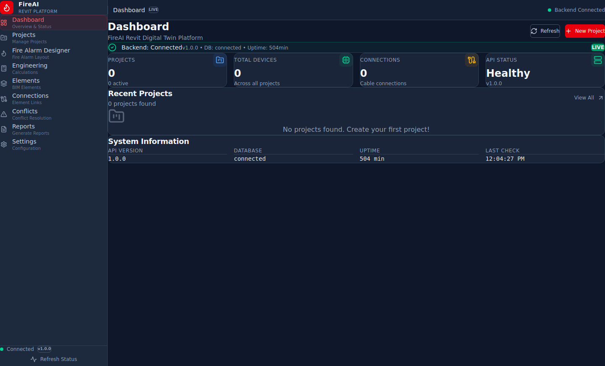</td>
      <td>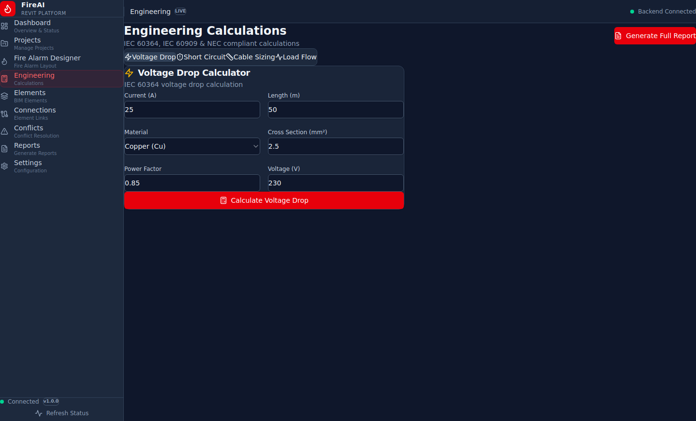</td>
      <td>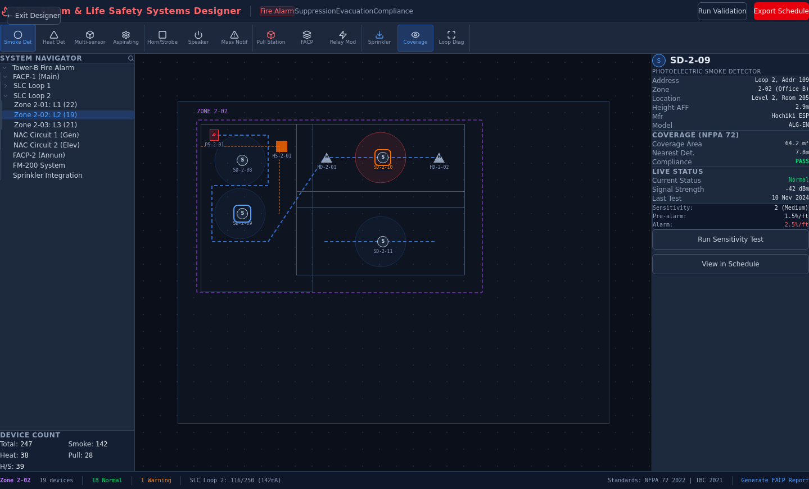</td>
    </tr>
    <tr>
      <td align="center"><strong>Dashboard</strong></td>
      <td align="center"><strong>Engineering Workspace</strong></td>
      <td align="center"><strong>Fire Alarm Designer</strong></td>
    </tr>
    <tr>
      <td>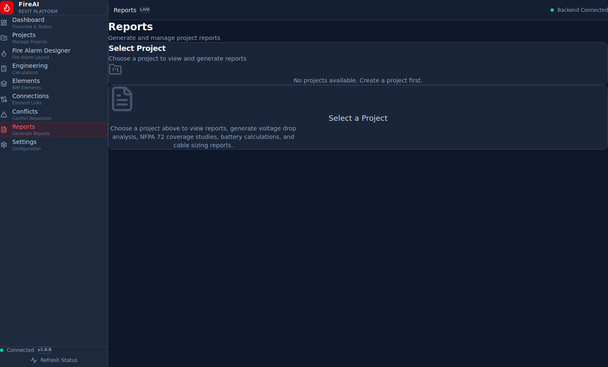</td>
      <td>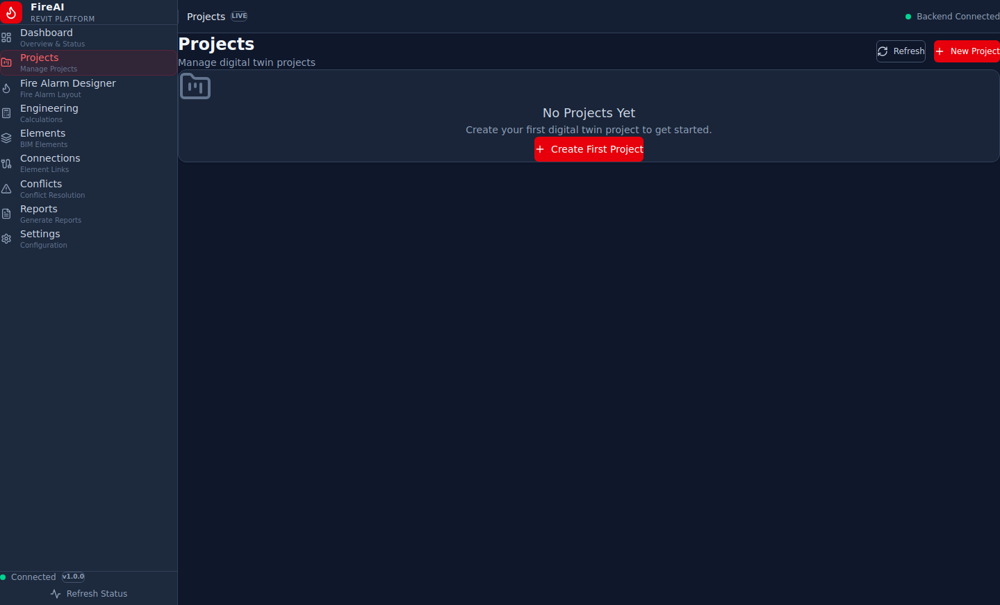</td>
      <td>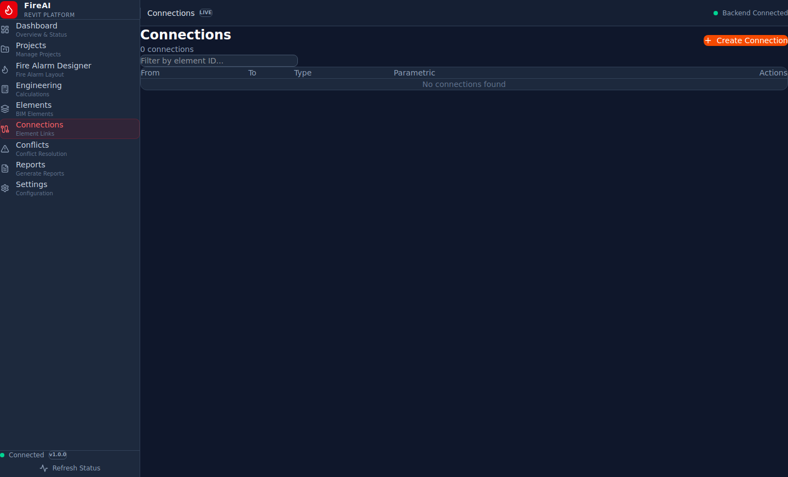</td>
    </tr>
    <tr>
      <td align="center"><strong>Compliance Center</strong></td>
      <td align="center"><strong>Project Management</strong></td>
      <td align="center"><strong>Connections</strong></td>
    </tr>
  </table>
</div>

---

## Key Features

<table>
  <tr>
    <td><strong>🔥 Fire Protection Engineering</strong></td>
    <td>NFPA 72 coverage, acoustics, voltage drop, battery sizing, egress, duct detectors, smoke management</td>
  </tr>
  <tr>
    <td><strong>📐 CAD &amp; BIM Integration</strong></td>
    <td>DWG, DXF, IFC, PDF, Excel, Word, Revit JSON, Image parsing with geometry extraction</td>
  </tr>
  <tr>
    <td><strong>🧠 AI Agents</strong></td>
    <td>Learning agent, predictive agent, self-improvement engine, tool selector, LangGraph workflows</td>
  </tr>
  <tr>
    <td><strong>✅ Compliance Engine</strong></td>
    <td>NFPA 72 (2022), NEC Chapter 9, UL 864, IBC, ATEX, International standards selector</td>
  </tr>
  <tr>
    <td><strong>🔗 Integration Hub</strong></td>
    <td>Revit, AutoCAD, Bentley, IFC, Open-Meteo, Nominatim, WAQI, NWS, Hazmat DB</td>
  </tr>
  <tr>
    <td><strong>🔐 Security</strong></td>
    <td>contextIsolation, sandbox, CSP, HMAC audit chains, blockchain readiness, input sanitization</td>
  </tr>
  <tr>
    <td><strong>📊 Reporting</strong></td>
    <td>PDF reports, DXF schedules, Revit export, compliance proof documents, audit trails</td>
  </tr>
  <tr>
    <td><strong>🖥️ Desktop App</strong></td>
    <td>Electron + React + Vite, 157 MB ARM64 AppImage, FastAPI backend, 54 API endpoints</td>
  </tr>
</table>

---

## Architecture

<div align="center">
  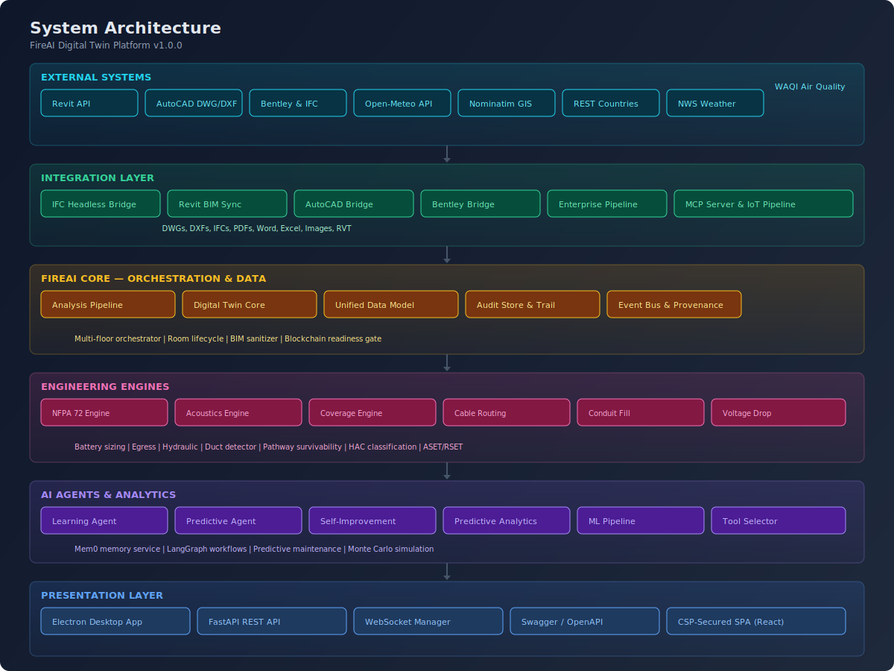
  <br>
  <em>7-layer architecture: External Systems → Integration → Core → Engineering Engines → AI Agents → Analytics → Presentation</em>
</div>

### Detailed Architecture Diagrams

| Diagram | Description |
|---------|-------------|
| [System Architecture](docs/assets/architecture/system-architecture.svg) | Full 7-layer platform architecture |
| [Component Architecture](docs/assets/architecture/component-architecture.svg) | Frontend + Backend component breakdown |
| [Data Flow](docs/assets/architecture/data-flow.svg) | User → Electron → Backend → Database → External APIs |
| [Integration Flow](docs/assets/architecture/integration-flow.svg) | BIM, External APIs, Enterprise & IoT integrations |
| [AI Agent Flow](docs/assets/architecture/ai-agent-flow.svg) | Agent layer, analytics, memory, output generation |
| [Engineering Pipeline](docs/assets/architecture/engineering-pipeline.svg) | 7-stage: Import → Validate → Analyze → Route → Compliance → Output → Audit |
| [Deployment Architecture](docs/assets/architecture/deployment-architecture.svg) | Desktop standalone + Client-server enterprise |

---

## Feature Status

### CAD Integration
- ✅ **DWG Parser** — `parsers/dwg_parser.py` — Path-security hardened (V122)
- ✅ **DXF Parser** — `parsers/dxf_parser.py` — Text + ezdxf extraction
- ✅ **IFC Parser** — `parsers/ifc_parser.py` — ISO 16739, STEP instance extraction
- ✅ **PDF Parser** — `parsers/pdf_parser.py` — Text extraction with security hardening
- ✅ **Excel Parser** — `parsers/excel_parser.py` — XLSX data extraction
- ✅ **Word Parser** — `parsers/word_parser.py` — DOCX content extraction
- ✅ **Image Parser** — `parsers/image_parser.py` — OCR and geometry extraction
- ✅ **Revit JSON Parser** — `parsers/revit_json_parser.py` — Revit JSON export parser
- ✅ **RVT Parser** — `parsers/rvt_parser.py` — Revit project parsing
- ✅ **AutoCAD Bridge** — `fireai/integration/autocad_bridge.py`

### BIM Integration
- ✅ **Revit BIM Sync** — `fireai/bridges/revit_bim_sync.py` — Bidirectional sync engine
- ✅ **IFC Headless Bridge** — `fireai/bridges/ifc_headless_bridge.py`
- ✅ **Bentley Bridge** — `fireai/integration/bentley_bridge.py`
- ✅ **Enterprise Pipeline** — `fireai/bridges/enterprise_pipeline.py`

### Engineering Intelligence
- ✅ **NFPA 72 Engine** — Coverage, calculations, models, schemas, technology dispatcher
- ✅ **Acoustics Engine** — SPL, audible coverage, UGLD raytrace, ISO 9613
- ✅ **Electrical** — Voltage drop (NEC Ch.9), battery sizing (NFPA 72 §10.6.7), SLC capacitance
- ✅ **Cable Routing** — Topology, circuit class (NFPA 72 §12.2), pathway survivability (§12.4)
- ✅ **Conduit** — Fill (NEC Ch.9), bend radius, fitting engine, routing
- ✅ **Spatial** — Density optimizer, MIP solver, Voronoi verifier, exact coverage
- ✅ **Hydraulic** — Hazen-Williams calculations, sprinkler analysis
- ✅ **Egress** — NFPA 101, RSET/ASET calculation
- ✅ **Duct Detectors** — NFPA 72 §17.7.5 placement
- ✅ **Elevator Shunt Trip** — NFPA 72 §21.4, heat detector placement
- ✅ **Notification Appliances** — NAC load, SPL, strobe candela
- 🟡 **FACP Panel Selection** — UL 864, battery sizing, capacity audit
- 🟡 **Fire Zone Engine** — Zone clustering per NFPA 72 §21.3.3

### AI Agents
- ✅ **Learning Agent** — `fireai/agents/learning_agent.py` — Project-level learning
- ✅ **Predictive Agent** — `fireai/agents/predictive_agent.py`
- ✅ **Self-Improvement Engine** — `fireai/agents/self_improvement_engine.py`
- ✅ **Tool Selector** — `fireai/agents/tool_selector.py`
- ✅ **Predictive Analytics** — `fireai/analytics/predictive_analytics.py`
- ✅ **ML Pipeline** — `fireai/analytics/ml_pipeline.py`
- ✅ **Mem0 Memory** — `backend/services/memory_service.py`
- 🟡 **LangGraph Workflow** — `backend/services/workflow_service.py` (requires langgraph)

### Compliance Validation
- ✅ **NFPA 72** — Full clause-mapped compliance engine
- ✅ **NEC Chapter 9** — Conduit fill, voltage drop
- ✅ **UL 864** — FACP listing compliance
- ✅ **IBC** — Firestopping, egress
- ✅ **ATEX / IEC 60079** — Hazardous area classification
- ✅ **International Standards** — Jurisdiction selector (NEC, CEC, ATEX, IEC)
- ✅ **Multi-Standard Validator** — `fireai/validation/multi_standard_validator.py`
- ✅ **QA Engine** — `fireai/validation/qa_engine.py`

### Digital Twin
- ✅ **Digital Twin Core** — `fireai/core/digital_twin.py`
- ✅ **Digital Twin Interface** — `fireai/core/digital_twin_interface.py`
- ✅ **Digital Twin Sync** — `fireai/core/digital_twin_sync.py`
- ✅ **Twin Database** — `fireai/core/twin_db.py`
- ✅ **Unified Data Model** — `core/database.py`, `core/models.py`

### Security
- ✅ **contextIsolation** — Enabled in Electron
- ✅ **sandbox** — Enabled in Electron
- ✅ **CSP Headers** — `default-src 'self'; connect-src 'self' http://localhost:* ws://localhost:*`
- ✅ **HMAC Audit Chain** — SHA-256 proof chain, Merkle trees
- ✅ **Secret Rotation** — `fireai/core/secret_rotation.py`
- ✅ **Security Logging** — `fireai/core/security_logging.py`
- ✅ **BIM Input Sanitizer** — RCE, SQLi, path traversal, XSS prevention
- ✅ **Submittal Integrity** — TOCTOU detection (CWE-367)
- ✅ **Rate Limiting** — Per-endpoint rate limiting
- ✅ **CORS** — Configurable origin restrictions

### Reporting
- ✅ **PDF Reports** — `fireai/core/pdf_report.py`
- ✅ **DXF Schedules** — `fireai/core/dxf_table_schedule.py`
- ✅ **Revit Export** — `fireai/core/revit_exporter.py`
- ✅ **Compliance Proof Documents** — `fireai/core/compliance_proof_document.py`
- ✅ **AHJ Submittal Package** — `fireai/core/ahj_submittal_package.py`
- ✅ **BOQ Generator** — `fireai/core/boq_generator.py`
- ✅ **CSD Generator** — `fireai/core/csd_generator.py`

### Deployment
- ✅ **Linux ARM64 AppImage** — 157 MB, production-ready
- 🟡 **Windows x64** — Requires CI runner (No Wine on ARM64)
- 🔵 **macOS** — Planned for future release
- 🔵 **Docker/K8s** — Configs available in `deploy/`

---

## Quick Start

### Prerequisites

```bash
# System dependencies (Linux)
apt-get install -y python3 python3-pip nodejs npm libasound2t64 libxkbcommon0 libgbm1 libgtk-3-0 libnss3
```

### Run from Source

```bash
# Clone the repository
git clone https://github.com/ahmdelbaz28-ux/revit.git
cd revit

# Backend setup
pip install -r requirements.txt

# Frontend setup
cd frontend && npm install
npm run build

# Start the backend (serves frontend automatically)
cd ..
export FIREAI_ENV=development
python -m backend.app

# In another terminal, start Electron (optional)
cd frontend
npx electron electron/compiled/main.js
```

### Run Tests

```bash
# Python tests (5,954 tests)
python -m pytest tests/ -q

# Frontend tests (54 tests)
cd frontend && npm test
```

---

## Development

### Project Structure

```
revit/
├── backend/              # FastAPI Python backend
│   ├── app.py            # Application entry point
│   ├── routers/          # 18 API routers
│   ├── services/         # External API services
│   └── database.py       # SQLite data layer
├── core/                 # Core data models
├── parsers/              # File format parsers
├── fireai/               # Engineering kernel
│   ├── core/             # 124+ engineering modules
│   ├── agents/           # AI agents
│   ├── analytics/        # ML & analytics
│   ├── bridges/          # BIM/CAD integration bridges
│   ├── conduits/         # Conduit engineering
│   ├── validation/       # Compliance validation
│   └── mcp_server/       # Model Context Protocol server
├── frontend/             # Electron + React SPA
│   ├── electron/         # Electron main/preload
│   ├── src/              # React components
│   └── dist/             # Vite build output
├── qomn_fire/            # QOMN-FIRE engineering kernel
├── qomn_conduit/         # QOMN conduit engineering
├── tests/                # 100+ test files (5,954 tests)
├── deploy/               # Docker, K8s, Helm configs
└── docs/                 # Documentation & assets
```

---

## Platform Status

| Status | Indicator | Details |
|--------|-----------|---------|
| **Release Status** | 🟡 Release Candidate | v1.0.0 — All code gates pass |
| **Build Status** | ✅ PASS | ARM64 AppImage (157 MB) |
| **Runtime Status** | ✅ PASS | Backend 54/54 routes, health check |
| **Security Status** | ✅ PASS | 0 critical, 0 exploitable high vulns |
| **Test Status** | ✅ PASS | 5,954 Python + 54 TypeScript, 0 failures |
| **Code Coverage** | ⚠️ 39% | Security modules 91%, kernel 62% avg |
| **Windows Build** | ❌ BLOCKED | Requires Windows CI runner |
| **macOS Build** | 🔵 Planned | Future milestone |

---

## System Flow

<div align="center">
  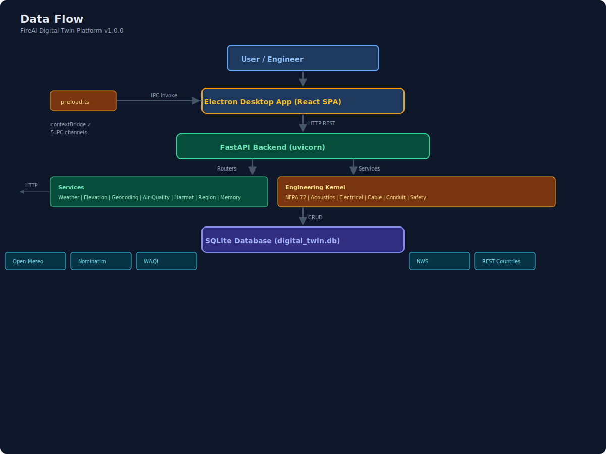
  <br>
  <em>End-to-end data flow: User → Electron → Backend → Services → Database → External APIs</em>
</div>

### Engineering Pipeline

<div align="center">
  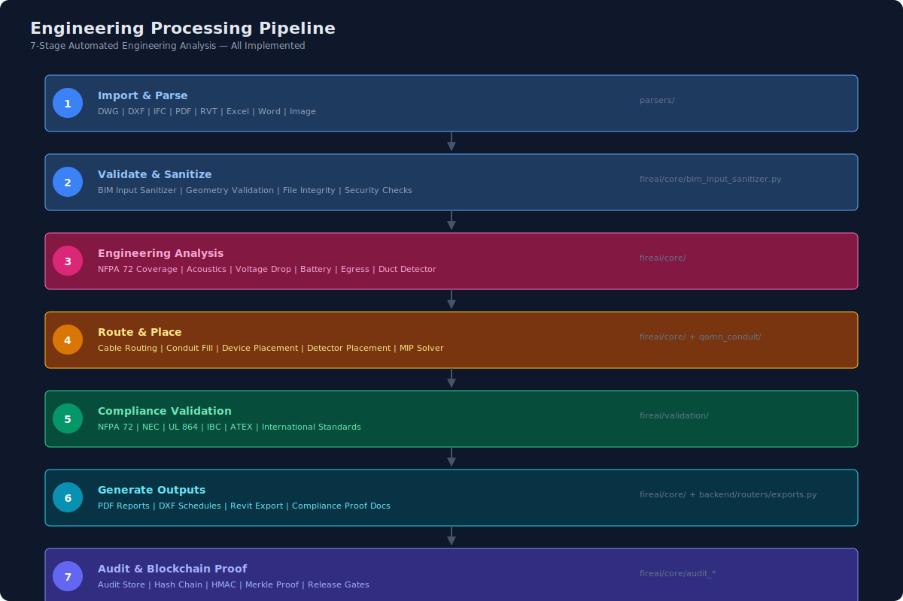
  <br>
  <em>7-stage automated engineering analysis pipeline</em>
</div>

---

## Integrations

<div align="center">
  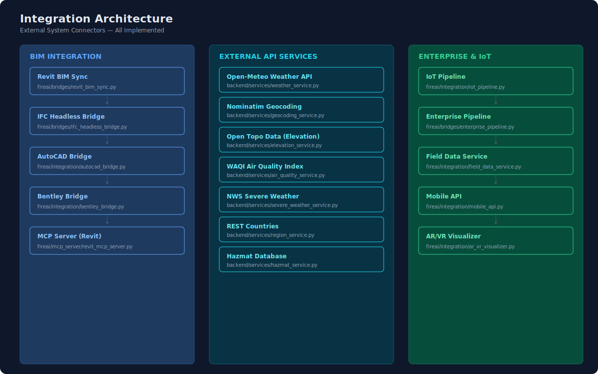
  <br>
  <em>All external system connectors — fully implemented</em>
</div>

### External APIs
- **Open-Meteo** — Weather data for environmental analysis
- **Nominatim** — Geocoding for location-based calculations
- **Open Topo Data** — Elevation data for terrain analysis
- **WAQI** — Air quality index integration
- **NWS** — Severe weather alerts and data
- **REST Countries** — Regional regulatory data
- **Hazmat DB** — Hazardous material database

---

## AI Agent System

<div align="center">
  
  <br>
  <em>Multi-agent AI system with analytics and memory layer</em>
</div>

---

## Roadmap

<div align="center">
  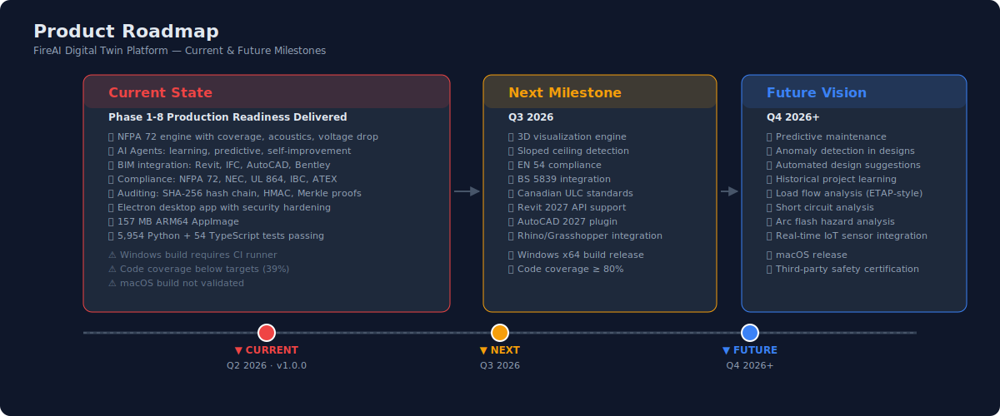
</div>

---

## Security

FireAI implements defense-in-depth security:

- **Electron Hardening**: contextIsolation, sandbox, CSP, nodeIntegration disabled
- **IPC Allow-List**: Only 5 read-only channels exposed to renderer
- **Input Validation**: BIM input sanitizer prevents RCE, SQLi, XSS, path traversal
- **Audit Chain**: HMAC-SHA256 evidence chain with Merkle proof support
- **Secret Management**: Automated secret rotation with key freshness checks
- **Submittal Integrity**: TOCTOU detection preventing design tampering
- **Rate Limiting**: Per-endpoint request throttling

See [SECURITY.md](SECURITY.md) and [ELECTRON_SECURITY_REPORT.md](ELECTRON_SECURITY_REPORT.md) for details.

---

## Tests

| Suite | Count | Status |
|-------|-------|--------|
| Python (pytest) | 5,954 | ✅ 100% pass |
| TypeScript (vitest) | 54 | ✅ 100% pass |
| Security tests | 247+ | ✅ CSP, input sanitization, audit |
| Coverage (fireai) | 39% | ⚠️ Improving |
| Coverage (security) | 91% | ✅ Above target |

---

## License

This project is licensed under the MIT License — see the [LICENSE](LICENSE) file for details.

---

## Author

**Eng. Ahmed Elbaz**
- GitHub: [@ahmdelbaz28-ux](https://github.com/ahmdelbaz28-ux)
- Repository: [github.com/ahmdelbaz28-ux/revit](https://github.com/ahmdelbaz28-ux/revit)

---

<div align="center">
  <sub>Built with ❤️ for fire protection engineering | Safety First • Precision Always</sub>
  <br>
  <sub>NFPA 72 · NEC · UL 864 · IBC · ATEX · ISO 16739</sub>
</div>
