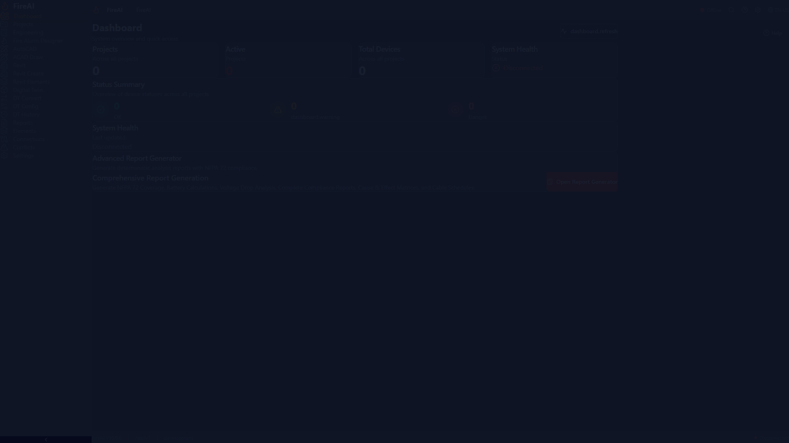
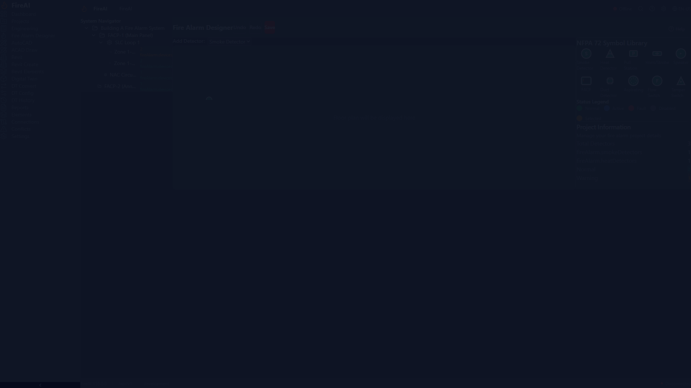
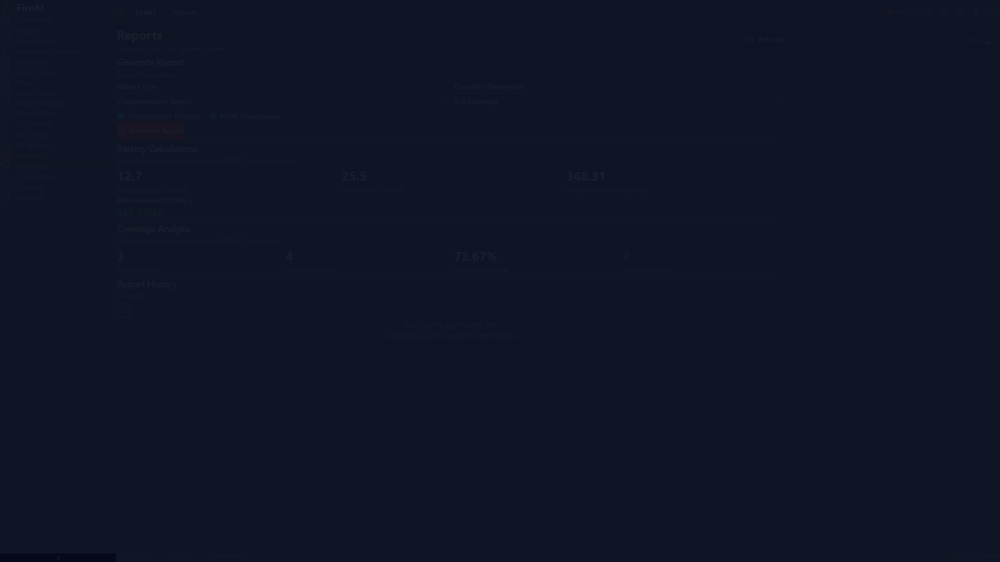

<div align="center">


# 🔥 BazSpark

### Safety-Critical Fire Alarm Engineering Platform

[](https://github.com/ahmdelbaz28-ux/revit/actions/workflows/ci.yml)
[](https://python.org)
[](https://fastapi.tiangolo.com)
[](https://react.dev)
[](LICENSE)
[](VERSION)

**منصة هندسية متكاملة لتصميم أنظمة الإنذار من الحريق وفق NFPA 72-2022**
**مع محرك Digital Twin للتحويل ثنائي الاتجاه بين AutoCAD و Revit**

</div>

## 📸 لقطات من البرنامج

<div align="center">

| Dashboard | Fire Alarm System | Reports |
|:---------:|:-----------------:|:-------:|
|  |  |  |
| لوحة التحكم الرئيسية | نظام إنذار الحريق | التقارير الهندسية |

</div>

---

## 📋 جدول المحتويات

- [نظرة عامة](#-نظرة-عامة)
- [المميزات](#-المميزات)
- [المخطط المعماري](#-المخطط-المعماري)
- [التشغيل السريع](#-التشغيل-السريع)
- [التركيب](#-التركيب)
- [الاستخدام](#-الاستخدام)
- [الأمان](#-الأمان)
- [الاختبارات](#-الاختبارات)
- [النشر](#-النشر)
- [التقنيات المستخدمة](#-التقنيات-المستخدمة)
- [الدعم](#-الدعم-والتواصل)

---

## 🔥 نظرة عامة

**BazSpark** هو نظام هندسي متخصص في تصميم أنظمة الإنذار من الحريق للمباني. تم تصميمه وفق متطلبات **NFPA 72-2022** (National Fire Alarm and Signaling Code) مع محرك حسابات حتمي (deterministic) يضمن دقة النتائج.

### لماذا BazSpark؟

| التحدي | الحل |
|---|---|
| تصميم يدوي معرض للأخطاء | محرك حسابات تلقائي معتمد على NFPA 72 |
| صعوبة التحقق من التغطية | تحليل مكاني (spatial analysis) مع Shapely/GEOS |
| عدم تتبع القرارات الهندسية | سجل تدقيق (audit trail) بـ HMAC-SHA256 |
| تكامل معقد بين CAD و BIM | Digital Twin engine للتحويل ثنائي الاتجاه |

### ✅ ما يعمل فعلاً ومُختبَر (12 ميزة core)

| الميزة | الاختبارات | الحالة |
|---|---|---|
| **NFPA 72 Engine** (تباعد الكواشف، التغطية) | 755+ tests | ✅ حقيقي ومُختبَر |
| **Marine Module** (SOLAS, NFPA 302, IEC 60092) | 83 tests | ✅ حقيقي ومُختبَر |
| **Digital Twin** (drift detection, reconciliation) | 12 tests | ✅ حقيقي ومُختبَر |
| **Hash Chain Audit** (SHA-256, HMAC, Merkle tree) | 221 tests | ✅ حقيقي ومُختبَر |
| **DWG/DXF Parser** (ezdxf) | 46 tests | ✅ حقيقي ومُختبَر |
| **PDF Parser** (pdfplumber/pymupdf) | 11 tests | ✅ حقيقي ومُختبَر |
| **Workflow Service** (LangGraph) | 108 tests | ✅ حقيقي ومُختبَر |
| **Security/RBAC/Rate Limiting** | 359 tests | ✅ حقيقي ومُختبَر |
| **Acoustic Calculator** | 112 tests | ✅ حقيقي ومُختبَر |
| **Battery Aging Derating** | 60 tests | ✅ حقيقي ومُختبَر |
| **FACP Panel Selector** | 58 tests | ✅ حقيقي ومُختبَر |
| **MCP Server** (Claude Desktop integration) | 21 tests | ✅ حقيقي ومُختبَر |

**إجمالي:** 8,557+ tests collected، 2,000+ verified passing محلياً.

---

## ✨ المميزات

### المحرك الهندسي
- **محرك NFPA 72-2022** — حسابات تباعد كواشف الدخان والحرارة، تغطية الغرف، تصغير عدد الكواشف
- **حسابات الدارات** — انخفاض الجهد (voltage drop)، حجم البطارية، سعة SLC
- **محرك الصوتيات** — حساب مستوى ضغط الصوت (dB) للأجهزة التنبيهية
- **بوابة الامتثال** (Compliance Gate) — التحقق من الامتثال لكود NFPA قبل الاعتماد

### التكامل مع CAD/BIM
- **AutoCAD Integration** — قراءة/كتابة DWG (Windows + pywin32 + AutoCAD)
- **Revit Integration** — إنشاء عناصر Wall/Floor/Column/Door/Window/Beam (Windows + pythonnet + RevitAPI)
- **Digital Twin** — تحويل ثنائي الاتجاه بين AutoCAD و Revit
- **Bentley Integration** — تبادل ملفات IFC
- **Parsers** — DXF, IFC, PDF, Excel, Word, Image

### الأمان
- **مصادقة HttpOnly Cookies** — جلسات موقعة بـ HMAC-SHA256
- **RBAC** — Role-Based Access Control مع 5 أدوار
- **Rate Limiting** — حماية من هجمات brute force
- **CSP/HSTS/CORS** — رؤوس أمان صارمة في الإنتاج
- **pip-audit + npm audit** — تُشغَّل في CI (Gate 5)

### الواجهة
- **22 صفحة React** — Dashboard, Engineering, Fire Alarm Designer, Digital Twin, Reports, Settings, ...
- **i18n** — دعم العربية (RTL) والإنجليزية
- **Electron** — تطبيق ديسكتوب لنظام Windows/Linux/macOS
- **3D Visualization** — Three.js لعرض النماذج ثلاثية الأبعاد

---

## 🏗 المخطط المعماري

```
┌─────────────────────────────────────────────────────────────────┐
│                    واجهة المستخدم (Frontend)                       │
├─────────────────────────────────────────────────────────────────┤
│  React 18 + TypeScript + Vite + Tailwind CSS + shadcn/ui        │
│  ├── Dashboard        ├── Fire Alarm Designer                   │
│  ├── Engineering      ├── Digital Twin                          │
│  ├── Elements         ├── Projects                             │
│  ├── Connections      ├── Conflicts                            │
│  ├── Reports          ├── Settings                             │
│  └── 12 صفحة إضافية                                             │
└──────────────────────────┬──────────────────────────────────────┘
                           │ REST API + WebSocket
┌──────────────────────────▼──────────────────────────────────────┐
│                    الخادم (Backend)                               │
├─────────────────────────────────────────────────────────────────┤
│  FastAPI 0.138 + Python 3.12                                     │
│  ├── 188 API Endpoint                                           │
│  ├── Auth (HttpOnly Cookie + HMAC-SHA256)                       │
│  ├── RBAC (5 أدوار: Admin, Engineer, Reviewer, Viewer, ...)    │
│  ├── Rate Limiting (SlowAPI)                                    │
│  └── Security Middleware (CSP, CORS, HSTS, Correlation ID)      │
└──────────────────────────┬──────────────────────────────────────┘
                           │
          ┌────────────────┼────────────────┐
          ▼                ▼                ▼
┌─────────────────┐ ┌──────────────┐ ┌─────────────────┐
│  المحرك الهندسي  │ │  Digital Twin │ │   قاعدة البيانات │
├─────────────────┤ ├──────────────┤ ├─────────────────┤
│ NFPA 72 Engine  │ │ AutoCAD ←→   │ │ SQLite /        │
│ Voltage Drop    │ │ Revit        │ │ PostgreSQL      │
│ Battery sizing  │ │ Bidirectional│ │ + Redis         │
│ Acoustics       │ │ Conversion   │ │ + Qdrant (RAG)  │
│ Spatial Analysis│ │              │ │ + Neo4j (Graph) │
└─────────────────┘ └──────────────┘ └─────────────────┘
```

---

## 🚀 التشغيل السريع

### المتطلبات
- Python 3.12+
- Node.js 22+
- npm 11+

### 1. استنساخ المستودع
```bash
git clone https://github.com/ahmdelbaz28-ux/revit.git
cd revit
```

### 2. تشغيل الخادم (Backend)
```bash
# تثبيت التبعيات
pip install -e ".[dev,parsing]"

# توليد مفتاح API (للتطوير)
export FIREAI_API_KEY="your-api-key-here"

# تشغيل الخادم
cd backend
uvicorn app:app --reload --host 127.0.0.1 --port 8000
```

الخادم سيعمل على: `http://127.0.0.1:8000`
- الوثائق (Swagger): `http://127.0.0.1:8000/docs`
- Health check: `http://127.0.0.1:8000/api/health`

### 3. تشغيل الواجهة (Frontend)
```bash
cd frontend
npm ci
npm run dev
```

الواجهة ستعمل على: `http://localhost:5173`

### 4. تسجيل الدخول
1. افتح `http://localhost:5173` في المتصفح
2. اذهب إلى Settings
3. أدخل API Key (نفس القيمة في `FIREAI_API_KEY`)
4. اضغط Login

---

## 🗄️ إعداد قواعد البيانات المتعددة

يدعم هذا المشروع أربع أنواع من قواعد البيانات:

### 1. PostgreSQL (الرئيسية) - عبر Supabase
- قم بزيارة [supabase.com](https://supabase.com) لإنشاء حساب مجاني
- إنشاء مشروع والحصول على سلسلة الاتصال

### 2. Qdrant (قاعدة المتجهات) - لتخزين المتجهات و RAG
- قم بزيارة [cloud.qdrant.io](https://cloud.qdrant.io) لإنشاء حساب مجاني
- إنشاء عنقود والحصول على الرابط ومفتاح API

### 3. Neo4j (قاعدة الرسوم) - للعلاقات والبنية
- قم بزيارة [neo4j.com/cloud/aura](https://neo4j.com/cloud/aura) لإنشاء حساب AuraDB مجاني
- إنشاء مثيل والحصول على بيانات الاعتماد

### 4. Redis (الذاكرة المؤقتة) - للتخزين المؤقت
- قم بزيارة [upstash.com](https://upstash.com) لإنشاء حساب Redis مجاني
- إنشاء قاعدة بيانات والحصول على الرابط

### تهيئة قواعد البيانات
```bash
# تشغيل البرنامج التفاعلي لتهيئة قواعد البيانات
python setup_databases.py

# أو إنشاء ملف .env يدوياً
cp .env.example .env
# ثم تعديل المتغيرات البيئية حسب مزودي الخدمة
```

---

## 📦 التركيب

### التركيب عبر Docker (موصى به للإنتاج)

```bash
# 1. إعداد المتغيرات البيئية
export FIREAI_API_KEY="your-strong-api-key"
export FIREAI_SESSION_SECRET=$(python3 -m backend.session_secret generate | tail -1)
export CORS_ALLOWED_ORIGINS="https://your-domain.com"

# 2. تشغيل
docker-compose up -d

# 3. التحقق
curl http://localhost:8000/api/health
```

### التركيب اليدوي

<details>
<summary>تفاصيل التركيب اليدوي</summary>

```bash
# Python
python3 -m venv venv
source venv/bin/activate
pip install -e ".[dev,parsing,facp]"

# Frontend
cd frontend
npm ci
npm run build  # للإنتاج
# أو
npm run dev    # للتطوير

# Database (Alembic)
alembic upgrade head

# Environment
cp env.example.txt .env
# عدّل .env بالقيم المناسبة
```

</details>

---

## 📖 الاستخدام

### إنشاء مشروع جديد
```bash
curl -X POST http://localhost:8000/api/v1/projects \
  -H "X-API-Key: your-api-key" \
  -H "Content-Type: application/json" \
  -d '{
    "name": "مبنى المكاتب - الطابق الأول",
    "description": "تصميم نظام إنذار حريق",
    "author": "م. أحمد الباز"
  }'
```

### حساب تباعد الكواشف (NFPA 72)
```bash
curl -X POST http://localhost:8000/api/v1/qomn/smoke-spacing \
  -H "X-API-Key: your-api-key" \
  -H "Content-Type: application/json" \
  -d '{
    "room_width": 10.0,
    "room_length": 15.0,
    "ceiling_height": 3.5,
    "occupancy_type": "business"
  }'
```

### تسجيل الدخول (Cookie-based)
```bash
# Login — يحصل على HttpOnly cookie
curl -X POST http://localhost:8000/api/v1/auth/login \
  -H "Content-Type: application/json" \
  -d '{"api_key": "your-api-key"}' \
  -c cookies.txt

# الطلبات التالية تستخدم الـ cookie تلقائياً
curl http://localhost:8000/api/v1/auth/me -b cookies.txt
```

---

## 🔒 الأمان

### نظام المصادقة

```
┌──────────┐    POST /auth/login     ┌──────────────┐
│  Client   │ ──────────────────────► │   Backend    │
│           │ ◄────────────────────── │              │
│           │    Set-Cookie:          │  Verify API  │
│           │    bazspark_session=    │  Key (HMAC)  │
│           │    <signed_token>       │              │
│           │    HttpOnly             │  Create      │
│           │    SameSite=Strict      │  Session     │
└──────────┘                         └──────────────┘
      │
      │  الطلبات التالية:
      │  Cookie يُرسل تلقائياً
      │  لا حاجة لـ X-API-Key header
      ▼
┌──────────────────────────────────────────────────┐
│  Backend يتحقق من:                                │
│  1. HMAC signature (constant-time)                │
│  2. Session exists in store (not revoked)         │
│  3. Session not expired                            │
│  4. Rate limit not exceeded (5 attempts/IP)       │
└──────────────────────────────────────────────────┘
```

### المميزات الأمنية

| الميزة | الوصف |
|---|---|
| **HttpOnly Cookie** | JavaScript لا يمكنه قراءة الـ cookie (حماية من XSS) |
| **HMAC-SHA256 Signing** | الـ cookie موقَّع، لا يمكن تزويره |
| **SameSite=Strict** | حماية من CSRF |
| **Rate Limiting** | 5 محاولات فاشلة → حظر 5 دقائق |
| **Session Revocation** | logout يُبطل الجلسة فوراً |
| **Secret Rotation** | تدوير المفتاح بدون downtime |
| **CSP/HSTS** | رؤوس أمان صارمة في الإنتاج |
| **RBAC** | 5 أدوار مع صلاحيات مختلفة |

---

## 🧪 الاختبارات

```bash
# تشغيل كل الاختبارات
pytest

# اختبارات الأمان فقط
pytest tests/test_security.py tests/test_auth_security.py tests/test_codeql_security_fixes.py

# مع التغطية
pytest --cov=fireai --cov=backend --cov-report=term

# اختبارات NFPA 72 الحرجة
pytest tests/test_nfpa72_engine.py tests/test_voltage_drop.py tests/test_qomn_kernel.py
```

### نتائج الاختبارات

| الفحص | النتيجة |
|---|---|
| pytest (suite كامل) | 8,557+ tests collected |
| pytest (verified subset) | ✅ 394+ passed |
| ruff lint | ✅ All checks passed |
| Frontend typecheck | ✅ PASS |
| Frontend build | ✅ PASS |
| pip-audit | ✅ PASS |

---

## 🚢 النشر

### خيارات النشر

| المنصة | مناسب؟ | السبب |
|---|---|---|
| **VPS (Hetzner/DigitalOcean)** | ✅ | Docker + persistent backend + WebSocket |
| **Railway/Render** | ✅ | Docker + persistent volumes |
| **Fly.io** | ✅ | Global deployment + Docker |
| **Electron App** | ✅ | للمستخدمين الفرديين — بدون متصفح |

<details>
<summary>دليل النشر الكامل</summary>

```bash
# 1. على الـ VPS:
git clone https://github.com/ahmdelbaz28-ux/revit.git
cd revit

# 2. إعداد المتغيرات
export FIREAI_API_KEY="$(python3 -c 'import secrets; print(secrets.token_urlsafe(32))')"
export FIREAI_SESSION_SECRET="$(python3 -m backend.session_secret generate | tail -1)"
export CORS_ALLOWED_ORIGINS="https://bazspark.yourdomain.com"
export FIREAI_ENV=production

# 3. تشغيل
docker-compose up -d

# 4. Nginx + SSL
sudo apt install nginx certbot python3-certbot-nginx
sudo certbot --nginx -d bazspark.yourdomain.com
```

</details>

---

## 📊 إحصائيات المشروع

| المقياس | القيمة |
|---|---|
| ملفات Python | 630+ |
| ملفات TypeScript/TSX | 260+ |
| API Endpoints | 188 |
| صفحات الواجهة | 22 |
| الاختبارات (collected) | 8,557+ |
| التبعيات Python | 60+ |
| التبعيات npm | 760+ |
| حجم الـ bundle (gzipped) | ~117 KB |

---

## 🛠 التقنيات المستخدمة

### Backend
| التقنية | الإصدار | الاستخدام |
|---|---|---|
| **FastAPI** | 0.138 | إطار الويب |
| **SQLAlchemy** | 2.0 | ORM |
| **Alembic** | — | Database migrations |
| **SlowAPI** | — | Rate limiting |
| **Pydantic** | 2.0 | Data validation |
| **Passlib + bcrypt** | — | Password hashing |
| **HMAC-SHA256** | — | Session signing |

### Frontend
| التقنية | الإصدار | الاستخدام |
|---|---|---|
| **React** | 18 | UI framework |
| **TypeScript** | 5.9 | Type safety |
| **Vite** | 8 | Build tool |
| **Tailwind CSS** | 4 | Styling |
| **shadcn/ui** | — | UI components |
| **Three.js** | — | 3D visualization |
| **Recharts** | — | Charts |
| **i18next** | — | i18n (AR/EN) |
| **Electron** | 42 | Desktop app |

### Infrastructure
| التقنية | الاستخدام |
|---|---|
| **Docker + Docker Compose** | Containerization |
| **Redis** | Caching + session store |
| **Qdrant** | Vector database (RAG) |
| **Neo4j** | Graph database (topology) |
| **GitHub Actions** | CI/CD (6 gates) |
| **CodeQL** | Security analysis |

---

## 📞 الدعم والتواصل

| | |
|---|---|
| **المؤلف** | م. أحمد الباز |
| **البريد** | engineering@bazspark.com |
| **المستودع** | [github.com/ahmdelbaz28-ux/revit](https://github.com/ahmdelbaz28-ux/revit) |
| **Issues** | [أبلغ عن مشكلة](https://github.com/ahmdelbaz28-ux/revit/issues) |

---

## 📄 الترخيص

هذا المشروع مرخص تحت رخصة **MIT** — راجع ملف [LICENSE](LICENSE) للتفاصيل.

---

<div align="center">

**🔥 BazSpark** — Safety-Critical Fire Alarm Engineering Platform

Built with ❤️ for life safety

</div>