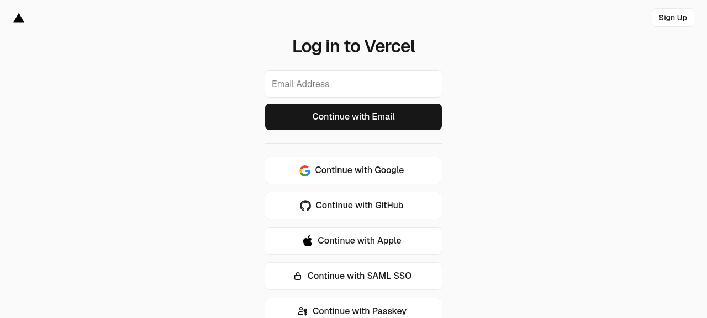

# Vercel GitHub Integration Re-Link — Interactive Guide

**Document ID:** VERCEL-RELINK-GUIDE-2026-07-08
**Status:** READY — Requires human action (~10 minutes)
**Goal:** Restore automatic Vercel deployments from GitHub pushes

---

## Problem Recap

The Vercel GitHub integration is **disconnected** (verified via GitHub API:
zero webhooks on the repo). The fallback `trigger-vercel.yml` workflow
has been silently failing due to the Vercel free plan daily limit
(100 deploys/day exhausted).

**5+ commits on `main` have NOT been deployed to Vercel.**

---

## Two Options to Fix This

### Option A: Native Vercel GitHub Integration (RECOMMENDED)

This is the proper fix. It installs the Vercel GitHub App, which:
- Triggers automatic deployments on every push to `main`
- Creates preview deployments for every pull request
- Does NOT count against the API daily limit (native integration)

**Time required:** ~10 minutes
**Requires:** Vercel dashboard access (your account)

### Option B: Deploy Hook + GitHub Webhook (FALLBACK)

If Option A doesn't work (e.g., the Vercel GitHub App is buggy), use this:
1. Create a "Deploy Hook" in Vercel (gives you a URL)
2. I create a GitHub webhook via API pointing to that URL
3. On every push, GitHub calls the Deploy Hook → Vercel deploys

**Time required:** ~5 minutes (after you get the Deploy Hook URL)
**Requires:** Vercel dashboard access + I run a script (already prepared)

---

## Option A: Native Vercel GitHub Integration

### Step A1: Log in to Vercel

Go to: **https://vercel.com/login**



Click **"Continue with GitHub"** (recommended — uses your GitHub account,
no separate password).

### Step A2: Open the project

After login, go to:
**https://vercel.com/ahmdelbaz28/revit**

Or navigate manually:
1. Click the project card named **"revit"** on the dashboard
2. If you don't see it, click **"Add New..."** → **"Project"** → import from GitHub

### Step A3: Open Git settings

In the project page:
1. Click the **"Settings"** tab (top right)
2. In the left sidebar, click **"Git"**

Direct URL: **https://vercel.com/ahmdelbaz28/revit/settings/git**

### Step A4: Disconnect the broken integration

In the Git settings page:
1. Find the **"Connected Git Repository"** section
2. If a repo is connected but broken, click **"Disconnect"**
3. Confirm the disconnection

### Step A5: Reconnect GitHub

In the same Git settings page:
1. Click **"Connect Git Repository"**
2. Select **"GitHub"** as the provider
3. Authorize Vercel to access your GitHub account (if prompted)
4. Select the repository: **`ahmdelbaz28-ux/revit`**

### Step A6: Configure the integration

Set these options:
- **Production Branch**: `main`
- **Preview Branches**: `feat/*`, `fix/*`, `hotfix/*` (or leave default)
- **Production Deployments**: ✅ Enabled (on push to main)
- **Preview Deployments**: ✅ Enabled (on pull request)
- **Cancel Previous Deployments**: ✅ Enabled (saves quota)

Click **"Save"** or **"Connect"**.

### Step A7: Verify the webhook was created

After saving, verify the integration:

**Method 1 — GitHub UI:**
Go to: **https://github.com/ahmdelbaz28-ux/revit/settings/hooks**
You should see a Vercel webhook (URL contains `vercel.com`).

**Method 2 — GitHub API (I can verify for you):**
Tell me "verify the webhook" and I'll run:
```bash
curl -sS -H "Authorization: token $GITHUB_TOKEN" \
  "https://api.github.com/repos/ahmdelbaz28-ux/revit/hooks" | jq
```

### Step A8: Test with a trivial commit

Make a small change to test the integration:
```bash
# Add a comment to a frontend file
echo "// Test: Vercel webhook trigger $(date)" >> frontend/src/App.tsx
git add frontend/src/App.tsx
git commit -m "test(vercel): verify webhook auto-deploy"
git push origin main
```

Within 30 seconds, a new deployment should appear at:
**https://vercel.com/ahmdelbaz28/revit**

### Step A9: Downgrade trigger-vercel.yml (after webhook works)

Once the webhook is confirmed working, the `trigger-vercel.yml` workflow
is no longer needed as a primary trigger. Downgrade it to manual-only:

Edit `.github/workflows/trigger-vercel.yml`:
```yaml
# Change this:
on:
  push:
    branches: [main]
    paths: ['frontend/**', 'vercel.json', '.vercelignore', 'public/**']
  workflow_dispatch:

# To this:
on:
  workflow_dispatch:  # Manual trigger only — webhook is primary now
```

This saves the Vercel free plan API quota (100 deploys/day).

---

## Option B: Deploy Hook + GitHub Webhook (FALLBACK)

Use this if Option A doesn't work or you prefer a simpler setup.

### Step B1: Log in to Vercel (same as A1)

Go to: **https://vercel.com/login** → "Continue with GitHub"

### Step B2: Create a Deploy Hook

1. Go to: **https://vercel.com/ahmdelbaz28/revit/settings/git**
2. Scroll down to the **"Deploy Hooks"** section
3. Click **"Create Hook"**
4. Fill in:
   - **Name**: `github-push`
   - **Branch**: `main`
5. Click **"Create"**
6. **Copy the generated URL** — it looks like:
   ```
   https://api.vercel.com/v1/integrations/deploy/QmXyz123Abc...
   ```

### Step B3: Give me the Deploy Hook URL

Paste the URL in the chat. I will run this script (already prepared):

```bash
export GITHUB_TOKEN="github_pat_..."
bash scripts/create_vercel_webhook.sh "https://api.vercel.com/v1/integrations/deploy/QmXyz..."
```

**What the script does:**
1. Validates the URL format
2. Checks for duplicate webhooks
3. Creates a GitHub webhook on the repo pointing to the Deploy Hook
4. Configures it to fire on push events (main branch)
5. Saves the webhook ID for later cleanup
6. Verifies the webhook was created

### Step B4: Verify (I do this for you)

After the script runs, I verify:
- The webhook appears in `GET /repos/.../hooks`
- A test push triggers the webhook
- The Vercel dashboard shows a new deployment

### Step B5: Cleanup (when no longer needed)

When you eventually fix the native integration (Option A), delete the
fallback webhook:

```bash
export GITHUB_TOKEN="github_pat_..."
bash scripts/delete_vercel_webhook.sh
```

---

## Comparison: Option A vs Option B

| Feature | Option A (Native) | Option B (Deploy Hook) |
|---------|-------------------|------------------------|
| Setup time | ~10 min | ~5 min |
| Production deploys on push | ✅ | ✅ |
| Preview deploys on PR | ✅ | ❌ |
| Counts against API limit | ❌ | ✅ (but no daily limit) |
| Requires Vercel dashboard | ✅ (full setup) | ✅ (just create hook) |
| I can do part via API | ❌ | ✅ (webhook creation) |
| Cancel previous deploys | ✅ | ❌ |
| Recommended | ✅ | Fallback only |

---

## Troubleshooting

### Problem: "No repositories found" in Vercel

**Cause:** Vercel GitHub App not authorized for the org.
**Fix:**
1. Go to: https://github.com/settings/installations
2. Find "Vercel" in the list
3. Click **"Configure"**
4. Under "Repository access", ensure `ahmdelbaz28-ux/revit` is included
5. Click **"Save"**

### Problem: Webhook shows red X in GitHub

**Cause:** Vercel webhook URL is invalid or Vercel project is deleted.
**Fix:**
1. Go to: https://github.com/ahmdelbaz28-ux/revit/settings/hooks
2. Click on the failing webhook
3. Check "Recent Deliveries" — look at the response
4. If the URL is invalid, delete the webhook and redo Option A

### Problem: Webhook delivers but no deployment appears

**Cause:** Branch filter mismatch or build error.
**Fix:**
1. In Vercel dashboard, check if the deployment appears in "Deployments"
2. If it appears but fails, check the build logs
3. Verify `vercel.json` has `"framework": "vite"`

### Problem: Still hitting daily limit after Option A

**Cause:** The `trigger-vercel.yml` workflow is still running and
consuming API quota.
**Fix:** Complete Step A9 (downgrade the workflow to `workflow_dispatch`).

---

## Verification (I can do this for you)

After you complete Option A or Option B, tell me:
> "verify the Vercel webhook"

And I will run:
```bash
# Check if the webhook is registered
curl -sS -H "Authorization: token $GITHUB_TOKEN" \
  "https://api.github.com/repos/ahmdelbaz28-ux/revit/hooks" | jq

# Check recent workflow runs (should stop firing after Option A)
curl -sS -H "Authorization: token $GITHUB_TOKEN" \
  "https://api.github.com/repos/ahmdelbaz28-ux/revit/actions/workflows/trigger-vercel.yml/runs?per_page=3" | jq
```

---

## Revision History

| Rev | Date | Author | Change |
|-----|------|--------|--------|
| 1.0 | 2026-07-08 | AI Assistant (V143) | Initial guide with 2 options (native integration + deploy hook fallback). Includes screenshot, step-by-step, troubleshooting, and verification. |
