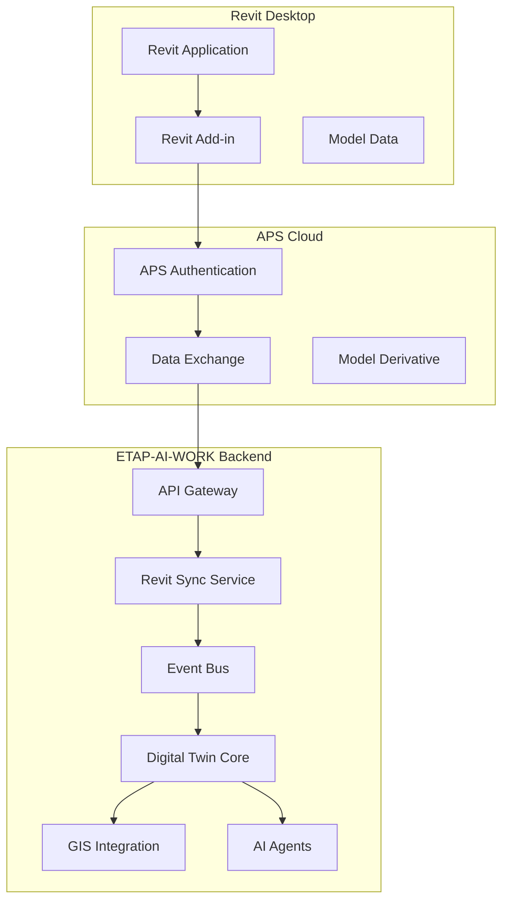

# ETAP-AI-WORK Revit Integration Architecture

## Overview
This document outlines the architecture for integrating Autodesk Revit into the ETAP-AI-WORK Digital Twin platform. The integration enables seamless synchronization of BIM data from Revit models into the Digital Twin ecosystem, supporting electrical asset management, GIS integration, and AI-powered analytics.

## Architecture Components

### 1. Revit Add-in (.NET 8 + Revit API)
- **Location**: `revit_integration/revit_addin/`
- **Purpose**: Client-side integration within Revit desktop application
- **Components**:
  - IExternalCommand implementations
  - Ribbon UI controls
  - Authentication & Authorization
  - Model synchronization engine
  - WebSocket communication layer

### 2. APS Data Exchange Layer
- **Location**: `revit_integration/aps/`
- **Purpose**: Cloud-based data exchange via Autodesk Platform Services
- **Components**:
  - APS authentication service
  - Data exchange connector
  - Ingestion pipeline
  - Delta update mechanism

### 3. Integration Adapters
- **Location**: `revit_integration/adapters/`
- **Purpose**: Translate between Revit data structures and ETAP-AI-WORK formats
- **Components**:
  - Revit Element Adapter
  - ETAP Data Model Adapter
  - IFC Fallback Adapter
  - GeoJSON Export Adapter

### 4. Data Transfer Objects
- **Location**: `revit_integration/dto/`
- **Purpose**: Standardized data contracts for Revit integration
- **Components**:
  - RevitElementDTO
  - ElectricalAssetDTO
  - SyncStatusDTO
  - ModelMetadataDTO

### 5. Mapping Engine
- **Location**: `revit_integration/mappings/`
- **Purpose**: Transform Revit categories to ETAP models
- **Components**:
  - CategoryMapper
  - ElectricalEquipmentMapper
  - SpatialMapper
  - GeometryMapper

### 6. Integration Services
- **Location**: `revit_integration/services/`
- **Purpose**: Core business logic for Revit integration
- **Components**:
  - RevitSyncService
  - ModelValidationService
  - AssetExtractionService
  - GeometryTransformationService

### 7. Event System Integration
- **Location**: `revit_integration/events/`
- **Purpose**: Publish Revit events to the ETAP event bus
- **Components**:
  - RevitEventPublisher
  - Event Definitions
  - Event Handlers

## Data Flow Architecture



## Revit Categories to ETAP Models Mapping

### Electrical Equipment
- **Revit Categories**: Electrical Equipment, Panel Schedule Graphics
- **ETAP Target**: Electrical Model
- **Attributes**: Name, Family, Type, Parameters, Location

### Power Systems
- **Revit Categories**: Electrical Circuits, Power Circuits
- **ETAP Target**: Load Flow Model
- **Attributes**: Voltage, Amperage, Circuit Paths

### Spatial Elements
- **Revit Categories**: Rooms, Spaces, Areas
- **ETAP Target**: GIS Model, SCADA Model
- **Attributes**: Boundary, Area, Volume, Coordinates

### Infrastructure
- **Revit Categories**: Conduits, Cable Trays, Wire
- **ETAP Target**: Electrical Model, GIS Model
- **Attributes**: Routing, Capacity, Connections

## API Contracts

### REST Endpoints
```
POST /api/v1/revit/sync - Initiate model synchronization
GET  /api/v1/revit/model/{id} - Retrieve model data
POST /api/v1/revit/upload - Upload Revit model
POST /api/v1/revit/export - Export to various formats
GET  /api/v1/revit/status - Get sync status
```

### WebSocket Endpoints
```
/ws/revit/{project_id} - Real-time sync updates
```

## Event Definitions

### Published Events
- `RevitModelImported` - Fired when model is successfully imported
- `RevitElementUpdated` - Fired when individual elements are updated
- `RevitTopologyChanged` - Fired when model topology changes
- `RevitSyncCompleted` - Fired when synchronization completes

## Integration Points

### With Existing ETAP Components
1. **EventBus**: Subscribe/Publish to existing event system
2. **StateStore**: Persist synchronization state
3. **SynchronizationEngine**: Coordinate with existing sync mechanisms
4. **GIS Database**: Insert geometry data into existing spatial store
5. **AI Agents**: Enable BIM querying capabilities

### Database Schema Extensions
New tables in existing database:
- `revit_projects` - Project metadata and sync status
- `revit_elements` - Individual element data
- `revit_sync_logs` - Synchronization logs and history

## Implementation Phases

### Phase 1: Foundation (Week 1-2)
- Core DTOs and data contracts
- Basic adapter patterns
- API endpoint scaffolding
- Initial event definitions

### Phase 2: Revit Add-in (Week 3-4)  
- .NET 8 Revit add-in development
- Authentication and login flow
- Basic sync functionality
- WebSocket communication

### Phase 3: APS Integration (Week 5-6)
- APS authentication service
- Data exchange connector
- Cloud model processing
- Fallback IFC support

### Phase 4: Mapping Engine (Week 7-8)
- Category-to-model mappings
- Geometry transformation
- Electrical asset extraction
- GIS integration

### Phase 5: Services & AI (Week 9-10)
- Core sync services
- AI agent integration
- Event system integration
- Advanced features

### Phase 6: Testing & Deployment (Week 11-12)
- Unit and integration tests
- End-to-end validation
- Performance optimization
- Production deployment

## Security Considerations
- OAuth 2.0 with APS
- Secure credential storage
- Model data encryption
- Access control for BIM data
- Audit logging for changes

## Performance Requirements
- Sub-second sync for models under 100MB
- Support for models up to 1GB
- Delta update capability
- Parallel processing of large models
- Caching for frequently accessed elements

## Compliance Requirements
- Autodesk Revit API licensing compliance
- APS terms of service compliance
- Data privacy regulations
- Industry standards adherence
- Version compatibility maintenance